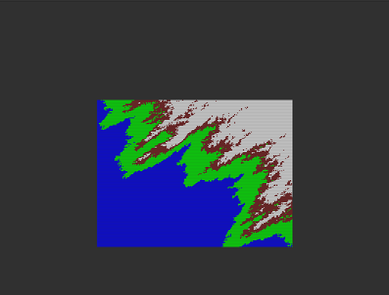

# FdF
FdF is project in 42 about reading a height map and draw a wire mesh in isometric projection depending on the map data using minilibx.
The data in the map will look something like this:
```
0  0  0  0  0  0  0  0  0  0  0  0  0  0  0  0  0  0  0
0  0  0  0  0  0  0  0  0  0  0  0  0  0  0  0  0  0  0
0  0 10 10  0  0 10 10  0  0  0 10 10 10 10 10  0  0  0
0  0 10 10  0  0 10 10  0  0  0  0  0  0  0 10 10  0  0
0  0 10 10  0  0 10 10  0  0  0  0  0  0  0 10 10  0  0
0  0 10 10 10 10 10 10  0  0  0  0 10 10 10 10  0  0  0
0  0  0 10 10 10 10 10  0  0  0 10 10  0  0  0  0  0  0
0  0  0  0  0  0 10 10  0  0  0 10 10  0  0  0  0  0  0
0  0  0  0  0  0 10 10  0  0  0 10 10 10 10 10 10  0  0
0  0  0  0  0  0  0  0  0  0  0  0  0  0  0  0  0  0  0
0  0  0  0  0  0  0  0  0  0  0  0  0  0  0  0  0  0  0
```
Where the numbers represent the altitude of each node.
Now the mandatory part is only about doing the above but I did all the bonus part where zoom,translate,node color,rotation,extra projection should be implemented.
for the extra projection I implemented orthographic projection because it was the easiest but actually the result of both projections turned out to be great.
Example of how my FdF draw the map in isometric projection:  
  
In orthographic projection:  
  
Examples with bigger maps:  
  
  
  
  
Resources:  
Roation Matrix: https://en.wikipedia.org/wiki/Rotation_matrix  
42 MinilibX docs: https://harm-smits.github.io/42docs/  
Isometric Projection: https://en.wikipedia.org/wiki/Isometric_projection  
DDA Line Drawing Algortihm: https://www.geeksforgeeks.org/dda-line-generation-algorithm-computer-graphics/  
Orthographic Projection: https://en.wikipedia.org/wiki/Orthographic_projection
